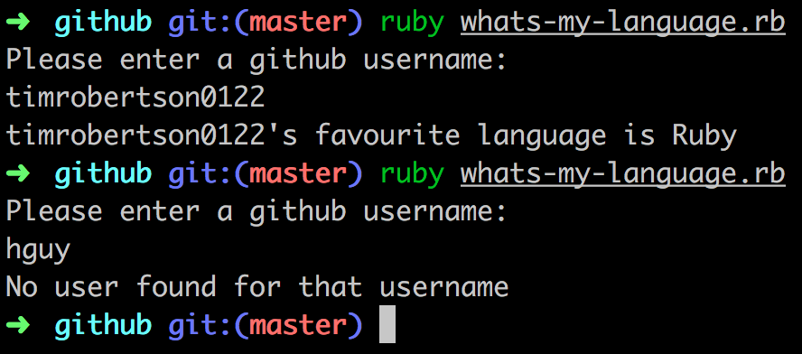
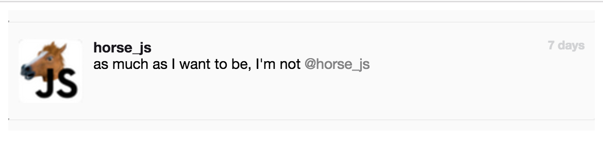

# unwrapped

Part One - Github Challenge

This runs as a Ruby script in the shell - `ruby whats-my-language.rb`, found in the `github` folder

- Opted to use RestClient as it provided a simple syntax and easy error handling.
- All errors are captured, with a custom error message provided when an associated github user was not found.
- Script collects all of the user's repos, strips out the language data of each one and then uses Ruby's Array methods to return the first language of the highest count.

Part Two - please open `horse.html` from within the `html` folder

- Used percentage width to enable the container to act responsively.
- Cropped icon from image provided.
- Used color picker as accurately as possible to replicate font colours.

Feedback

github test
===

The solution is a command line script that uses RestClient to communicate with github to extract the favourite language.

The solution doesn't have any tests which is a shame. It would have been nice to see what sorts of tests Tim would write for this kind of thing, and how it might affect his design choices for the solution. I know that Makers Academy does teach tests and TDD so it's a shame that Tim hasn't shown us that here.

The solution is a single script with all all the business logic embedded in the restclient callback block. This'll make it hard to write anything other than end-to-end integration tests, and make it hard to make changes with confidence. Even if we'd kept the same simple approach it would be nice to extract the contents of the block into some methods, perhaps one for the 200 case, one for the 404 case, etc...

We handle the errors we might get from the API by switching on the response code rather than the body text. This is good and shows that Tim understands the appropriate way to deal with HTTP apis and restful responses.

Most solutions calculate the favourite language with a hash where the key is the language, and the value is the count of occurances, but Tim does something different which is fun to see. Tim uses an array and then uniq, max_by, and count methods to get the favourite one. It amounts to the same thing as the hash-based solutions, but it's nice to see a different approach as it suggests Tim might approach other problems differently too and that's really useful in a team. A minor nitpick is that the array could be build using:

array = json.map { |repo| repo['language'] }

rather than the .each version Tim has. This would be slightly more idiomatic.

The solution doesn't cope with the nil language pr oblem (some repos don't have a language according to the API), nor does it cope multiple favourites (users who have 2 languages with the same count). I suspect the problem here is that without tests to drive the design of the solution Tim hasn't thought about possible error conditions in the data, just in the API.

horse test
===

The solution looks reasonably like the design, with the following exceptions:

1. we do have rounded corners on the avater, but this is because the image itself has rounded corners in it
2. the borders at the top and bottom of the "tweet" don't have the embossed effect (worse, because they are HRs they have a black pixel at the far left)

On the whole though, a good effort visually.

If we add extra text to the tweet it doesn't break the design. If we add extra tweets it falls apart slightly, as the borders are contained within the tweet and have padding, so we get them doubled up. It could be argued this is as expected in the design though (it doesn't show multiple tweets).

The HTML uses a lot of divs (almost every bit of content is wrapped in multiple div elements as containers) - it would be nicer to use some more semantic elements to help describe the importance of each component, perhaps a main element, or section or article even? A time element for the "7 days" content would be nice too. The choice of a p1 tag for the @horse_js mention is worrying - this isn't a valid html element - and would be better served with an anchor tag.

There are no media-queries in the CSS and so what responsiveness we get is what we get by default from using block level elements like divs. The `width: 40%` rule does mean that the tweet looks pretty skinny on a smaller screen though. On some screen sizes the "7 days" text also flips down to the bottom of the tweet, almost on top of the bot tom border. It might be better to float the time text rather than constrain it's width to fit in.

Apart from that the CSS is reasonable, it's not overly specified and the classnames make sense. They describe the content, not the display. The major issues are using percentage widths, which mean on smaller screens things start flipping around as we mentiond above.

general notes
===

Tim has delivered the solutions in a git repo and included a readme file explaining some of his choices and assumptions. This is really useful and helps us understand a bit more about how Tim approached the test, and how he works. The git commit messages could do with a bit more context and some gardening, as a couple of them are the same "re-structure" and one still has a [WIP] flag. It's absolutely fine to use WIP tags and quick commits while working, but before presenting the work to others (in a pull-request say) it's nice to squash commits and reword them to get rid of [WIP] tags and provide more details.
